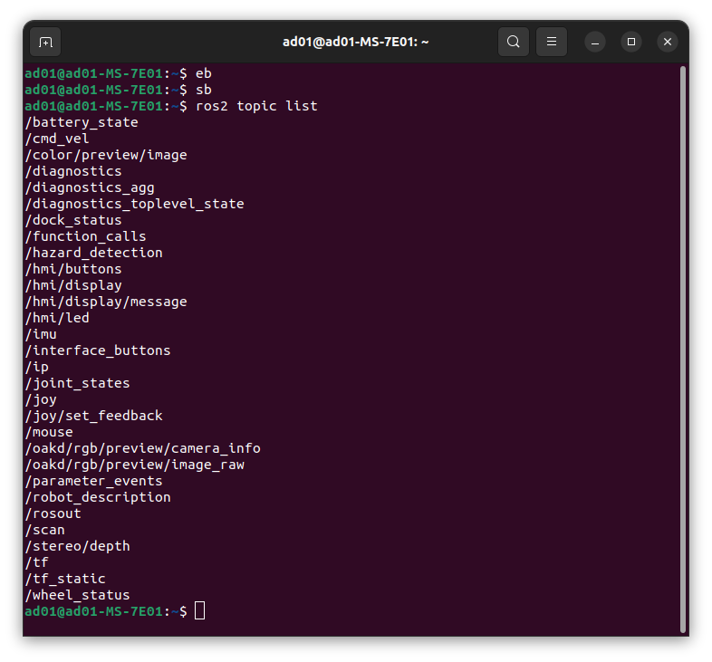
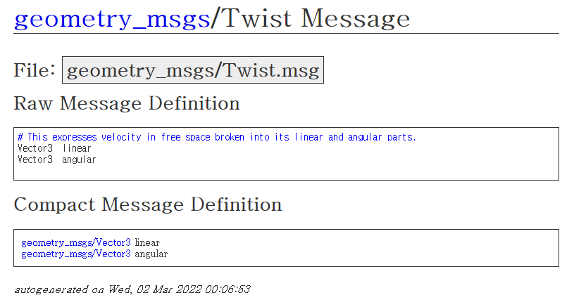
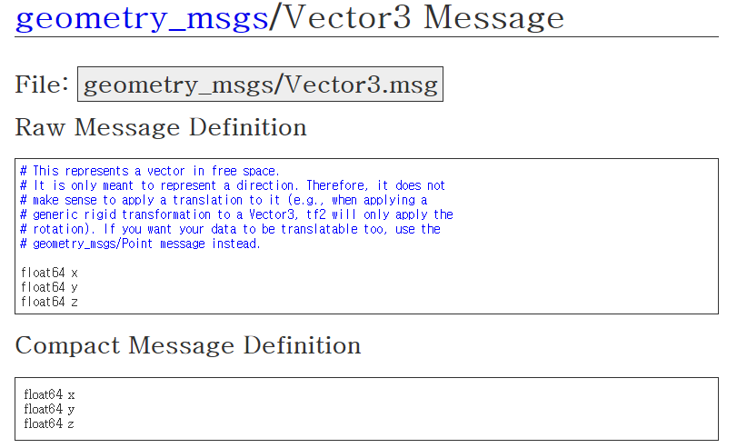
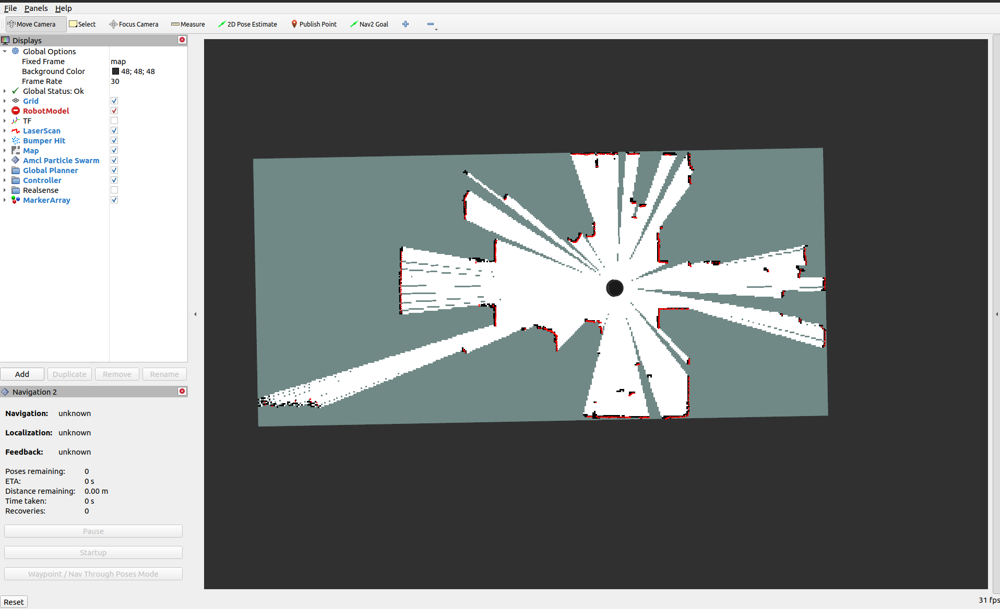
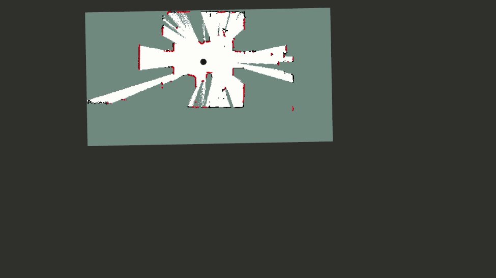
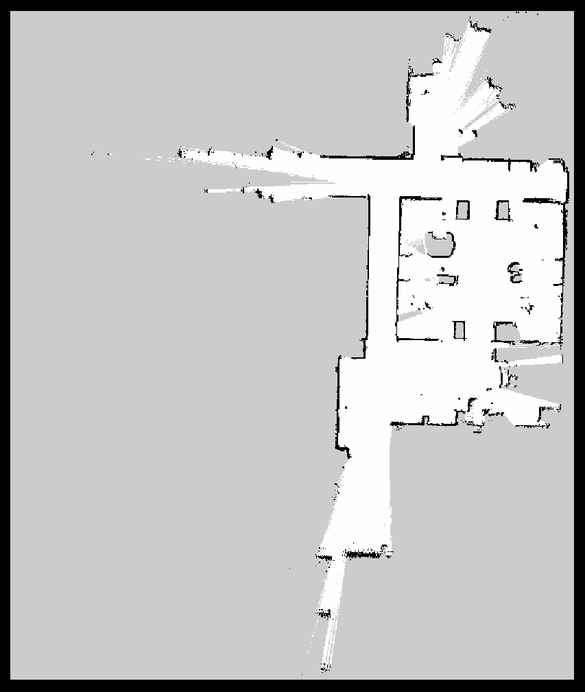
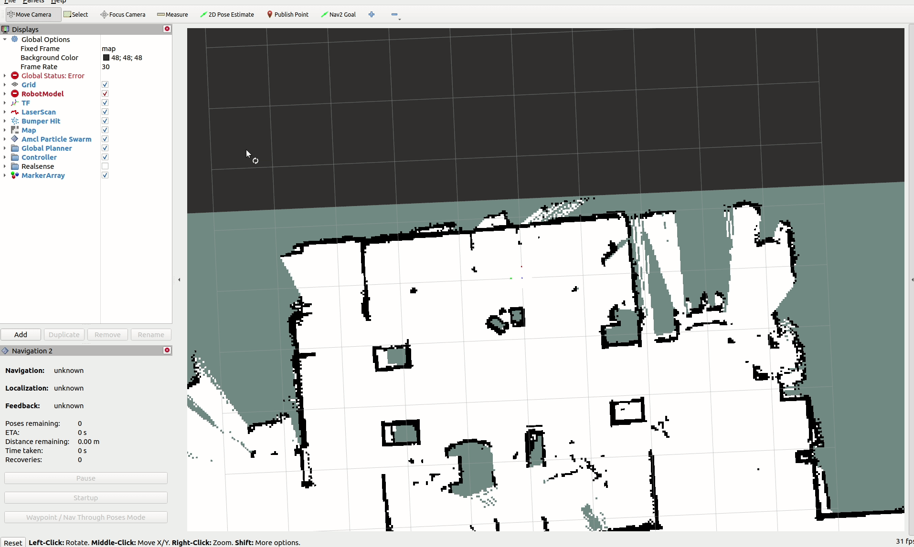

# 2023 한국항공대 자율주행 경진대회
## Turtlebot Quickstart Guide  
자율주행경진대회 참가자들을 위한 가이드입니다.  
주기적으로 내용이 추가되거나 변경될 수 있습니다.  

### Contents
1. How to Set PC & Turtlebot4  
   1.1 ROS Domain Setting  
   1.2 Turning On/Off  
2. ROS2  
   2.1 Node, Topic, Message  
   2.2 Service, Action  
   2.3 Useful Nodes
3. Mapping & Navigation  
   3.1 SLAM & Rviz2  
   3.2 Localization & Nav2  

### 1. How to Set PC & Turtlebot4
```
기계관 107호에 준비된 PC와 터틀봇은 경진대회 참가를 위해 모두 세팅되어 있습니다.  
기계관 107호 PC로 작업하실 경우 Domain만 설정하면 사용 가능합니다.  
개인 노트북을 활용하여 작업을 하셔도 상관없으나 조교가 도움을 주기 어려울 수 있습니다.  
```

#### 1.1 ROS Domain Setting
먼저 독에 장착되어 있는 터틀봇 하나를 가져옵니다. 정면의 5개의 LED가 모두 점등되어 있을 경우 정상이며, Display를 통해 IP와 잔여 배터리의 양을 확인할 수 있습니다.  
{: width="50%" height="50%"}  
  
Display에 표시된 IP주소, 위 사진의 경우 `192.168.50.134`를 확인하고 PC의 브라우저를 열어 뒤에 `:8080`을 붙여 주소창에 입력해주세요.  
`Application` -> `Configuration`에 들어가 `ROS2 Domain ID`를 확인해주세요. 아래 사진의 경우 `7`입니다.  
  
  
브라우저를 닫고 `Ctrl + Alt + T`를 눌러 터미널 창을 켠 후 `gedit ~/.bashrc` 또는 `eb`를 입력해주세요.  
  
텍스트 에디터가 뜨는데 마지막 줄에 있는 `export ROS_DOMAIN_ID=` 뒤에 아까 확인한 숫자를 넣고 `Save`후 끕니다.   
  
터미널 창에 `source ~/.bashrc` 또는 `sb`를 입력해 바꾼 설정을 적용시킵니다.  
  
터틀봇과 PC가 통신할 준비를 완료했습니다.  
`ros2 topic list`를 입력하였을 때 다음과 같이 여러 토픽이 나오면 잘 연결된 것입니다.  
  

#### 1.2 Turning On/Off
오류가 발생하여 터틀봇을 끄고 싶을 경우 앞에 있는 라이트링이 있는 버튼을 7초간 누르시면 3번 깜빡하고 소리가 울리며 꺼집니다.  
독에 장착되어 있을 경우 소리는 울리지만 꺼지지 않으며 독에서 장착이 해제되면 터틀봇이 꺼지게 됩니다.  
다시 터틀봇을 켜고 싶을 경우 독에 장착하면 켜집니다.  

#### 주의사항
* 터틀봇을 사용하실 때 터틀봇 정면에 초록 LED가 5개 모두 점등되어야 원활한 작동이 가능합니다.  
* 터틀봇을 들어 바퀴가 땅에 닿지 않을 경우 바퀴 모터가 작동하지 않습니다. 이 때 MTR LED가 꺼지는 것은 정상입니다.   
* **ssh를 통해 터틀봇 RPi에 진입하여 작업을 하지 말아주세요.**  
* 터틀봇은 배터리 15% 미만에서 자동으로 작동이 정지됩니다. 배터리가 30% 이하로 떨어질 경우 충전독에 올려놓으시고 다른 터틀봇으로 교체해주시기 바랍니다.  
* 터틀봇이 독에 올려져 있을 경우 전원 관리를 위해 카메라 등 여러 기능이 작동하지 않을 수 있습니다.  
* 기타 오류로 터틀봇이 작동하지 않으면 조금 기다려보신 후 조교에게 연락바랍니다.  
* 다른 팀을 위해 사용 종료 후 터틀봇을 독에 올려 충전시켜 주세요. 종료할 필요는 없습니다.  

### 2. ROS2  
ROS를 처음 사용해보시는 분들을 위한 내용입니다. ROS2에 익숙하실 경우 넘어가셔도 됩니다.  
ROS는 Robot Operation System으로 로봇 소프트웨어 개발을 위한 프레임워크입니다.  로봇 개발을 위한 여러 도구 모음이라고 생각하시면 됩니다.  
우리는 ROS2 통신을 사용하여 터틀봇의 센서 데이터를 받고, 터틀봇에 명령을 전달하여 터틀봇을 움직일 수 있습니다.  
#### 2.1 Node, Topic, Message
노드는 명령을 실행하기 위한 프로세스 단위입니다. 보통 코드 하나 당 하나의 노드라고 보시면 됩니다.  
토픽은 노드들이 메세지를 교환하는 통로라고 생각할 수 있습니다. 토픽을 통해 노드들은 메세지를 주고받습니다.  
토픽에 메세지를 송신하는 것을 **publish**라고 하며, 토픽의 메세지를 수신하는 것을 **subscribe**라고 합니다.  
`/oakd/rgb/preview/image_raw` 토픽과 `/scan` 토픽을 통해 터틀봇의 카메라와 라이다 센서값을 수신할 수 있으며,  
`/cmd_vel` 토픽을 통해 터틀봇을 움직힐 수 있습니다.  
##### Topic 관련 명령어
* `ros2 topic list` : 현재 활성화된 토픽을 보여줍니다.  
* `ros2 topic info <토픽이름>` : <토픽이름>의 DataType과 Publisher, Subscriber 수를 보여줍니다. 
* `ros2 topic echo <토픽이름>` : <토픽이름>으로 발행되는 메세지를 보여줍니다.  
   - 다음 명령을 통해 터틀봇에서 `/scan`이라는 토픽으로 발행하는 라이다 메세지를 수신할 수 있습니다.  
      ```
      ros2 topic echo /scan
      ```
* `ros2 topic pub <토픽이름> <메세지형식> <메세지>` : 터미널에서 <토픽이름>으로 <메세지>를 전달합니다. <메세지>는 <메세지형식>으로 정의되어 있습니다.  
   - 아래 명령을 통해 터틀봇을 1만큼의 속도로 앞으로 이동시킬 수 있습니다.  
      ```
      ros2 topic pub /cmd_vel geometry_msgs/msg/Twist "linear: x: 1.0, y: 0.0, z: 0.0 angular: x: 0.0, y: 0.0, z: 0.0" --once
      ```
  
##### Datatype
메세지는 약속된 규격의 DataType으로 송수신되어야 합니다. DataType은 사용자가 정의하여 사용할 수도 있지만, 보통 ROS 문서에서 잘 정의된 DataType을 사용합니다.  
보통 `/cmd_vel`은 로봇을 움직이는 토픽으로 사용됩니다. 다음 명령을 통해 `/cmd_vel`의 메세지 DataType을 알 수 있습니다.  
```
ros2 topic info /cmd_vel
```
  
{: width="60%" height="60%"}  
  
`/cmd_vel`은 `geometry_msgs/msg/Twist`라는 Type을 통해 메세지를 송수신합니다.  
`geometry_msgs/msg/Twist`를 검색하면 쉽게 `ROS Documentation`에서 DataType 정보를 확인할 수 있습니다.  
{: width="70%" height="70%"}  

`geometry_msgs/Twist`는 `linear`와 `angular`라는 이름의 `geometry_msgs/Vector3` 메세지로 다시 정의되어 있습니다. 이를 클릭하면,  
{: width="70%" height="70%"}  

`geometry_msgs/Vector3`는 `x`, `y`, `z`라는 이름의 실수 `float64`로 정의되어 있습니다.  
이를 통해 우리는 `/cmd_vel`은 linear과 angular, 각각 x, y, z 값으로 이루어진 것을 알 수 있습니다.  

#### 2.2 Service, Action   
토픽 이외에도 서비스와 액션을 통해 여러 동작을 할 수 있습니다. 이는 아래 예제에서 설명하겠습니다.  

#### 2.3 Useful Nodes
##### Teleoperation
키보드를 통해 터틀봇을 움직일 수 있는 노드입니다.  
다음 명령을 통해 `teleop_twist_keyboard.py` 코드를 작성해봅시다.  
```
gedit teleop_twist_keyboard.py
```
gedit을 이용하여 코드를 작성하셔도 되고, VS Code등의 IDE를 설치하여 사용하셔도 됩니다.  
```
#!/usr/bin/env python3
import rclpy
from rclpy.qos import qos_profile_default
from geometry_msgs.msg import Twist
import sys, select, termios, tty
settings = termios.tcgetattr(sys.stdin)
msg = """
---------------------------
Moving around:
   u(↖)  i(↑)  o(↗)
   j(←)   k    l(→)

anything else : stop

CTRL-C to quit
"""

moveBindings = {'i':(1,0,0,0), 'o':(1,0,0,-1), 'j':(0,0,0,1), 'l':(0,0,0,-1), 'u':(1,0,0,1),}

def getKey():
	tty.setraw(sys.stdin.fileno())
	select.select([sys.stdin], [], [], 0)
	key = sys.stdin.read(1)
	termios.tcsetattr(sys.stdin, termios.TCSADRAIN, settings)
	return key

def main(args=None):	
	if args is None:
		args = sys.argv
	rclpy.init(args)
	node = rclpy.create_node('teleop_twist_keyboard')
	pub = node.create_publisher(Twist, 'cmd_vel', qos_profile_default)
	speed = 0.5, turn = 1.0, x = 0, y = 0, z = 0, th = 0, status = 0
	try:
		print(msg)
		while(1):
			key = getKey()
			if key in moveBindings.keys():
				x = moveBindings[key][0]
				y = moveBindings[key][1]
				z = moveBindings[key][2]
				th = moveBindings[key][3]
			else:
				x = 0, y = 0, z = 0, th = 0
				if (key == '\x03'):
					break
			twist = Twist()
			twist.linear.x = x*speed; twist.linear.y = y*speed; twist.linear.z = z*speed;
			twist.angular.x = 0.0; twist.angular.y = 0.0; twist.angular.z = th*turn
			pub.publish(twist)
	except:
		print(e)
	finally:
		twist = Twist()
		twist.linear.x = 0.0; twist.linear.y = 0.0; twist.linear.z = 0.0
		twist.angular.x = 0.0; twist.angular.y = 0.0; twist.angular.z = 0.0
		pub.publish(twist)
		termios.tcsetattr(sys.stdin, termios.TCSADRAIN, settings)
```
모두 작성하면 저장한 후 다음 명령을 통해 코드를 실행하면 `u`, `i`, `o`, `j`, `k`, `l` 키를 이용해 키보드로 터틀봇을 움직일 수 있습니다.  
```
python3 teleop_twist_keyboard.py
```

##### Image Subscriber
터틀봇의 카메라를 다음을 통해 컴퓨터로 확인할 수 있습니다.  
```
gedit image_sub.py
```
```
#!/usr/bin/env python3
import rclpy
from rclpy.node import Node
from rclpy.qos import qos_profile_sensor_data
from sensor_msgs.msg import Image
import numpy as np
import cv2
from cv_bridge import CvBridge


class ImageSubscriber(Node) :
   def __init__(self) :
     super().__init__('image_subscriber')
     self.bridge = CvBridge() 
     self.image_sub = self.create_subscription(
        Image, '/oakd/rgb/preview/image_raw', self.image_cb, qos_profile_sensor_data)
     self.image = []

   def image_cb(self, msg) :
     self.image = self.bridge.imgmsg_to_cv2(msg, 'bgr8')
     cv2.imshow('img', self.image)
     cv2.waitKey(1)
     
def main(args=None) :
  rclpy.init(args=args)
  node = ImageSubscriber()
  rclpy.spin(node)
  node.destroy_node()
  rclpy.shutdown()

if __name__ == '__main__' :
  main()
```
```
python3 image_sub.py
```

##### LiDAR Subscriber
터틀봇의 라이다를 다음을 통해 컴퓨터로 확인할 수 있습니다. 
```
gedit lidar_sub.py
```
```
#!/usr/bin/env python3
import rclpy
from rclpy.node import Node
from rclpy.qos import qos_profile_sensor_data
from sensor_msgs.msg import LaserScan
import numpy as np
import cv2


class LiDARSubscriber(Node) :
   def __init__(self) :
     super().__init__('lidar_subscriber')
     self.lidar_sub = self.create_subscription(
        LaserScan, '/scan', self.lidar_cb, qos_profile_sensor_data)

   def lidar_cb(self, msg) :
     self.lidar = msg.ranges
     self.lidar = np.array(self.lidar)
     self.lidar = np.resize(self.lidar, (20, 720))
     cv2.imshow('img', self.lidar)
     cv2.waitKey(1)
     #print(self.lidar)
     
def main(args=None) :
  rclpy.init(args=args)
  node = LiDARSubscriber()
  rclpy.spin(node)
  node.destroy_node()
  rclpy.shutdown()

if __name__ == '__main__' :
  main()
```
```
python3 lidar_sub.py
```
### 3. Mapping & Navigation
터틀봇을 활용하여 매핑을 하거나 내비게이션을 하는 등의 여러 패키지들을 사용할 수 있습니다. 

#### 3.1 SLAM & Rviz2
##### SLAM
SLAM은 현재 위치를 추정하면서 지도를 작성하는 노드입니다. 터미널을 열어 SLAM 노드를 실행해봅시다.  
```
ros2 launch turtlebot4_navigation slam.launch.py
```
SLAM 노드는 터틀봇의 라이다 토픽을 받아 지도를 작성하여 지도 토픽을 내보내지만 시각적으로 보여주지는 않습니다. 

##### Rviz2
시각적으로 확인하기 위해서는 보통 Rviz라는 프로그램을 이용합니다.  
SLAM노드를 켜 놓은 상태로 다음 명령으로 rviz를 실행해봅시다.    
```
ros2 launch turtlebot4_viz view_robot.launch.py
```
{: width="80%" height="80%"}  
위의 `teleop_twist_keyboard`노드를 이용하여 터틀봇을 움직이면 지도를 작성하는 것을 확인할 수 있습니다. 
```
python3 teleop_twist_keyboard.py
```
{: width="80%" height="80%"}  
  
다음 서비스를 통해 제작된 맵을 저장할 수 있습니다.  
```
ros2 service call /slam_toolbox/save_map slam_toolbox/srv/SaveMap "name:
  data: 'map_name'"
```
기다린 후 result=0 이 나와야 제대로 저장된 것입니다.  
저장된 `map_name.pgm`파일을 열어보면 다음과 같이 확인할 수 있습니다.  
{: width="80%" height="80%"}  

#### 3.2 Localization & Nav2
##### Localization
로봇의 현재 위치를 추정하는 것을 localization이라고 합니다.  
`localization` 노드는 현재 위치의 초기값을 지정해주면 현재 위치를 추정할 수 있습니다.  
제작된 맵으로 현재 위치를 추정하는 `localization` 노드를 실행합니다.  
```
ros2 launch turtlebot4_navigation localization.launch.py map:=map_name.yaml
```
  
##### Nav2
Nav2는 여러 내비게이션 도구를 사용할 수 있는 패키지입니다. 맵 상에 목표 위치를 선택하면 그 곳으로 로봇을 자동으로 이동시킬 수 있습니다.  
`localization` 노드가 켜진 상태로 새 터미널을 열어 `nav2` 노드를 실행합니다.  
```
ros2 launch turtlebot4_navigation nav2.launch.py
```
`localization`, `nav2` 노드 또한 시각적으로 보여주지는 않습니다.  
다른 터미널을 열어 rviz를 실행합니다.  
```
ros2 launch turtlebot4_viz view_robot.launch.py
```

Rviz2에서 여러 Navigation 툴을 이용할 수 있습니다.  
    
* 2D Pose Estimate : 대략적인 로봇의 위치를 찍어주면 현재 위치를 추정할 수 있습니다.  
{: width="80%" height="80%"}  
* Publish Point: Map 상에 point를 publish합니다. /clicked_point 토픽으로 publish 됩니다. (`ros2 topic echo /clicked_point`로 확인)  
{: width="80%" height="80%"}  
* Nav2 Goal: 원하는 goal pose를 설정해 주면 Nav2가 로봇을 goal pose로 이동시키려고 시도합니다. 사용하기 전 initial pose를 설정해주어야 합니다.  
{: width="80%" height="80%"}  
